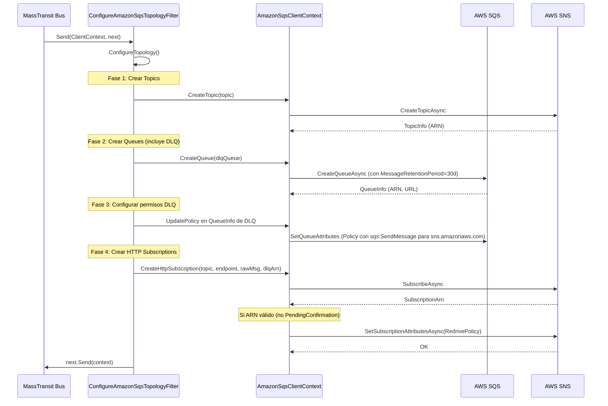
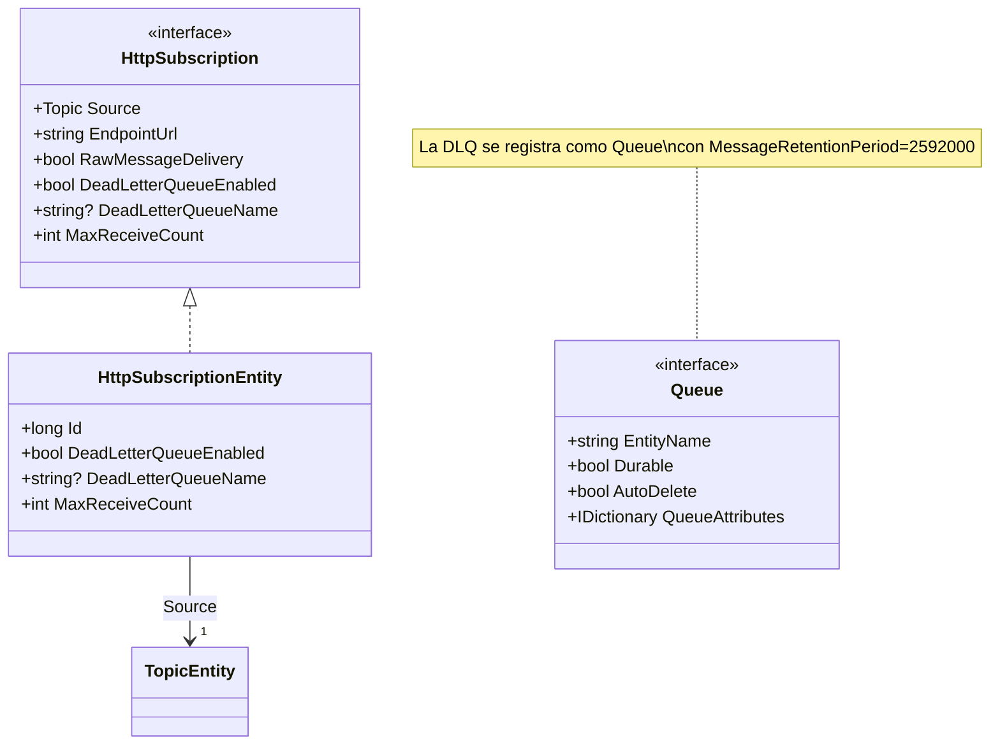

# Documento de Diseño: SNS HTTP Subscription DLQ

## Resumen

Este diseño extiende la funcionalidad existente de suscripciones HTTP de SNS para crear automáticamente una cola SQS Dead Letter Queue (DLQ) cuando se configura una suscripción HTTP. La DLQ captura mensajes que SNS no puede entregar al endpoint HTTP/HTTPS después de agotar los reintentos.

El diseño sigue la restricción crítica: **todos los cambios son aditivos** — no se modifica código original de MassTransit. Se extienden las interfaces y clases existentes del código custom (`IHttpTopicSubscriptionConfigurator`, `HttpTopicSubscriptionConfigurator`, `HttpSubscriptionConsumeTopologySpecification`, `AmazonSqsClientContext`).

### Decisiones de Diseño Clave

1. **Reutilización del patrón existente de `QueueInfo.UpdatePolicy`**: La lógica de permisos IAM ya existe en `QueueInfo` y maneja la serialización de acceso concurrente con `SemaphoreSlim`. Se reutiliza este método para configurar permisos de la DLQ.
2. **La DLQ se registra como `Queue` en el topology builder**: Esto garantiza que se crea en la fase de colas (antes de las suscripciones HTTP), aprovechando el orden existente en `ConfigureAmazonSqsTopologyFilter.ConfigureTopology`.
3. **El `RedrivePolicy` se configura después de crear la suscripción**: Se necesita el ARN de la suscripción para aplicar el atributo, por lo que se extiende el método `CreateHttpSubscription` del `AmazonSqsClientContext`.
4. **Opt-in por defecto**: `DeadLetterQueueEnabled = false` garantiza compatibilidad hacia atrás total.

---

## Arquitectura

### Flujo de Operaciones durante Bus Startup



### Componentes Modificados

| Componente | Tipo de Cambio | Descripción |
|---|---|---|
| `IHttpTopicSubscriptionConfigurator` | Extensión | Nuevas propiedades DLQ |
| `HttpTopicSubscriptionConfigurator` | Extensión | Implementación con validación |
| `HttpSubscriptionConsumeTopologySpecification` | Extensión | Registro de cola DLQ + validación |
| `AmazonSqsHttpSubscriptionExtensions` | Extensión | Paso de parámetros DLQ |
| `AmazonSqsClientContext` | Extensión | RedrivePolicy en CreateHttpSubscription |
| `ConfigureAmazonSqsTopologyFilter` | Extensión | Permisos IAM para DLQ |
| `HttpSubscription` (interface) | Extensión | Propiedades DLQ opcionales |
| `HttpSubscriptionEntity` | Extensión | Almacenamiento de datos DLQ |
| `IBrokerTopologyBuilder` | Sin cambio | Ya soporta `CreateQueue` |

---

## Componentes e Interfaces

### 1. IHttpTopicSubscriptionConfigurator (Extensión)

```csharp
public interface IHttpTopicSubscriptionConfigurator
{
    // ... propiedades existentes ...

    /// <summary>
    /// Habilita la creación automática de una cola SQS DLQ para la suscripción HTTP.
    /// Defaults to false.
    /// </summary>
    bool DeadLetterQueueEnabled { get; set; }

    /// <summary>
    /// Nombre personalizado para la cola DLQ. Si es null/vacío, se genera como {TopicName}-http-dlq.
    /// </summary>
    string? DeadLetterQueueName { get; set; }

    /// <summary>
    /// Número máximo de reintentos de entrega antes de enviar a la DLQ. Rango: 1-100. Default: 3.
    /// </summary>
    int MaxReceiveCount { get; set; }
}
```

### 2. HttpTopicSubscriptionConfigurator (Extensión)

```csharp
public class HttpTopicSubscriptionConfigurator : IHttpTopicSubscriptionConfigurator
{
    // ... existente ...

    private int _maxReceiveCount = 3;
    private string? _deadLetterQueueName;

    public bool DeadLetterQueueEnabled { get; set; } = false;

    public string? DeadLetterQueueName
    {
        get => _deadLetterQueueName;
        set
        {
            if (value != null)
            {
                if (value.Length > 80)
                    throw new ArgumentException("DeadLetterQueueName must not exceed 80 characters.", nameof(value));
                if (!IsValidQueueName(value))
                    throw new ArgumentException(
                        "DeadLetterQueueName must contain only alphanumeric characters, hyphens (-), and underscores (_).",
                        nameof(value));
            }
            _deadLetterQueueName = value;
        }
    }

    public int MaxReceiveCount
    {
        get => _maxReceiveCount;
        set
        {
            if (value < 1 || value > 100)
                throw new ArgumentOutOfRangeException(nameof(value), value,
                    "MaxReceiveCount must be between 1 and 100 (inclusive).");
            _maxReceiveCount = value;
        }
    }

    /// <summary>
    /// Resuelve el nombre final de la DLQ: usa DeadLetterQueueName si está definido,
    /// o genera {TopicName}-http-dlq.
    /// </summary>
    internal string ResolveDeadLetterQueueName()
    {
        return string.IsNullOrWhiteSpace(DeadLetterQueueName)
            ? $"{TopicName}-http-dlq"
            : DeadLetterQueueName;
    }

    private static bool IsValidQueueName(string name)
    {
        foreach (var c in name)
        {
            if (!char.IsLetterOrDigit(c) && c != '-' && c != '_')
                return false;
        }
        return true;
    }
}
```

### 3. HttpSubscriptionConsumeTopologySpecification (Extensión)

Se agrega un nuevo constructor que acepta parámetros DLQ y se extienden `Validate()` y `Apply()`:

```csharp
public class HttpSubscriptionConsumeTopologySpecification : ...
{
    // ... campos existentes ...
    readonly bool _deadLetterQueueEnabled;
    readonly string? _deadLetterQueueName;
    readonly int _maxReceiveCount;

    // Nuevo constructor con parámetros DLQ
    public HttpSubscriptionConsumeTopologySpecification(
        IAmazonSqsPublishTopology publishTopology,
        Uri hostAddress,
        string topicName,
        string endpointUrl,
        bool rawMessageDelivery,
        bool durable,
        bool autoDelete,
        bool deadLetterQueueEnabled,
        string? deadLetterQueueName,
        int maxReceiveCount)
        : base(topicName, durable, autoDelete)
    {
        // ... asignaciones existentes ...
        _deadLetterQueueEnabled = deadLetterQueueEnabled;
        _deadLetterQueueName = deadLetterQueueName;
        _maxReceiveCount = maxReceiveCount;
    }

    public IEnumerable<ValidationResult> Validate()
    {
        // ... validaciones existentes ...

        if (_deadLetterQueueEnabled)
        {
            var resolvedName = ResolveDeadLetterQueueName();

            if (string.IsNullOrWhiteSpace(resolvedName))
                yield return this.Failure("DeadLetterQueueName", "must not be empty");
            else if (resolvedName.Length > 80)
                yield return this.Failure("DeadLetterQueueName",
                    "must not exceed 80 characters");
            else if (!IsValidQueueName(resolvedName))
                yield return this.Failure("DeadLetterQueueName",
                    "must contain only alphanumeric characters, hyphens (-), and underscores (_)");
        }
    }

    public void Apply(IReceiveEndpointBrokerTopologyBuilder builder)
    {
        // ... lógica existente de topic ...

        // Registrar DLQ como Queue en el builder (se crea en fase de colas)
        if (_deadLetterQueueEnabled)
        {
            var dlqName = ResolveDeadLetterQueueName();
            var queueAttributes = new Dictionary<string, object>
            {
                ["MessageRetentionPeriod"] = "2592000" // 30 días
            };

            builder.CreateQueue(dlqName, Durable, AutoDelete, queueAttributes);
        }

        // Crear HTTP subscription con info de DLQ
        builder.CreateHttpSubscription(topicHandle, _endpointUrl, _rawMessageDelivery);
        // Nota: la info de DLQ se pasa a través de la entidad HttpSubscription extendida
    }

    string ResolveDeadLetterQueueName()
    {
        return string.IsNullOrWhiteSpace(_deadLetterQueueName)
            ? $"{EntityName}-http-dlq"
            : _deadLetterQueueName;
    }
}
```

### 4. HttpSubscription Interface (Extensión)

```csharp
public interface HttpSubscription
{
    // ... existente ...
    Topic Source { get; }
    string EndpointUrl { get; }
    bool RawMessageDelivery { get; }

    // Nuevas propiedades DLQ
    bool DeadLetterQueueEnabled { get; }
    string? DeadLetterQueueName { get; }
    int MaxReceiveCount { get; }
}
```

### 5. HttpSubscriptionEntity (Extensión)

```csharp
public class HttpSubscriptionEntity : HttpSubscription, HttpSubscriptionHandle
{
    // ... existente ...

    public HttpSubscriptionEntity(long id, TopicEntity topic, string endpointUrl,
        bool rawMessageDelivery, bool deadLetterQueueEnabled = false,
        string? deadLetterQueueName = null, int maxReceiveCount = 3)
    {
        // ... existente ...
        DeadLetterQueueEnabled = deadLetterQueueEnabled;
        DeadLetterQueueName = deadLetterQueueName;
        MaxReceiveCount = maxReceiveCount;
    }

    public bool DeadLetterQueueEnabled { get; }
    public string? DeadLetterQueueName { get; }
    public int MaxReceiveCount { get; }
}
```

### 6. IBrokerTopologyBuilder.CreateHttpSubscription (Extensión de firma)

Se agrega un overload con parámetros DLQ:

```csharp
public interface IBrokerTopologyBuilder
{
    // ... existente ...

    /// <summary>
    /// Create an HTTP/HTTPS subscription on a topic with optional DLQ configuration
    /// </summary>
    HttpSubscriptionHandle CreateHttpSubscription(TopicHandle topic, string endpointUrl,
        bool rawMessageDelivery, bool deadLetterQueueEnabled,
        string? deadLetterQueueName, int maxReceiveCount);
}
```

### 7. ConfigureAmazonSqsTopologyFilter (Extensión del método Declare para HttpSubscription)

```csharp
static async Task Declare(ClientContext context, HttpSubscription subscription, CancellationToken cancellationToken)
{
    string? dlqArn = null;

    // Si DLQ está habilitada, obtener el ARN de la cola DLQ ya creada y configurar permisos
    if (subscription.DeadLetterQueueEnabled && !string.IsNullOrWhiteSpace(subscription.DeadLetterQueueName))
    {
        var dlqQueueInfo = await context.GetQueueInfo(subscription.DeadLetterQueueName, cancellationToken)
            .ConfigureAwait(false);
        dlqArn = dlqQueueInfo.Arn;

        // Obtener TopicInfo para el ARN del topic
        var topicInfo = await context.CreateTopic(subscription.Source, cancellationToken).ConfigureAwait(false);

        // Configurar permisos IAM (reutiliza QueueInfo.UpdatePolicy)
        await dlqQueueInfo.UpdatePolicy(dlqQueueInfo.Arn, topicInfo.Arn, cancellationToken).ConfigureAwait(false);
    }

    var created = await context.CreateHttpSubscription(subscription.Source, subscription.EndpointUrl,
        subscription.RawMessageDelivery, dlqArn, subscription.MaxReceiveCount, cancellationToken)
        .ConfigureAwait(false);

    LogContext.Debug?.Log(created
        ? "Created HTTP subscription {Topic} -> {Endpoint}"
        : "Existing HTTP subscription {Topic} -> {Endpoint}",
        subscription.Source.EntityName, subscription.EndpointUrl);
}
```

### 8. AmazonSqsClientContext.CreateHttpSubscription (Extensión de firma)

Se extiende el método para aceptar `dlqArn` y `maxReceiveCount`:

```csharp
public async Task<bool> CreateHttpSubscription(Topology.Topic topic, string endpointUrl,
    bool rawMessageDelivery, string? dlqArn, int maxReceiveCount, CancellationToken cancellationToken)
{
    // ... lógica existente de SubscribeAsync ...

    // Después de obtener subscriptionArn válido:
    if (dlqArn != null && subscriptionArn != null && subscriptionArn != "PendingConfirmation")
    {
        try
        {
            var redrivePolicy = $"{{\"deadLetterTargetArn\":\"{dlqArn}\"}}";

            await _snsClient.SetSubscriptionAttributesAsync(new SetSubscriptionAttributesRequest
            {
                SubscriptionArn = subscriptionArn,
                AttributeName = "RedrivePolicy",
                AttributeValue = redrivePolicy
            }, cancellationToken).ConfigureAwait(false);

            LogContext.Info?.Log("Configured RedrivePolicy on subscription {SubscriptionArn} -> DLQ {DlqArn}",
                subscriptionArn, dlqArn);
        }
        catch (Exception ex)
        {
            LogContext.Error?.Log(ex,
                "Failed to configure RedrivePolicy on subscription {SubscriptionArn} -> DLQ {DlqArn}",
                subscriptionArn, dlqArn);
            throw new InvalidOperationException(
                $"Failed to set RedrivePolicy on subscription {subscriptionArn} targeting DLQ {dlqArn}", ex);
        }
    }
    else if (dlqArn != null && subscriptionArn == "PendingConfirmation")
    {
        LogContext.Warning?.Log(
            "Cannot configure RedrivePolicy for pending subscription on topic {Topic} -> {Endpoint}. " +
            "RedrivePolicy will need to be applied after subscription confirmation.",
            topic.EntityName, endpointUrl);
    }

    return subscriptionArn != null;
}
```

### 9. ClientContext Interface (Extensión)

```csharp
public interface ClientContext : PipeContext
{
    // ... existente ...

    // Overload extendido con soporte DLQ
    Task<bool> CreateHttpSubscription(Topology.Topic topic, string endpointUrl,
        bool rawMessageDelivery, string? dlqArn, int maxReceiveCount,
        CancellationToken cancellationToken);
}
```

---

## Modelos de Datos

### Entidades de Topología



### Configuración del Configurador

| Propiedad | Tipo | Default | Validación |
|---|---|---|---|
| `DeadLetterQueueEnabled` | `bool` | `false` | Ninguna |
| `DeadLetterQueueName` | `string?` | `null` | ≤80 chars, `[a-zA-Z0-9\-_]` |
| `MaxReceiveCount` | `int` | `3` | 1–100 inclusive |

### RedrivePolicy JSON

```json
{
  "deadLetterTargetArn": "arn:aws:sqs:us-east-1:123456789012:my-topic-http-dlq"
}
```

### Política IAM de la DLQ

```json
{
  "Version": "2012-10-17",
  "Statement": [
    {
      "Effect": "Allow",
      "Principal": {
        "Service": "sns.amazonaws.com"
      },
      "Action": "sqs:SendMessage",
      "Resource": "arn:aws:sqs:us-east-1:123456789012:my-topic-http-dlq",
      "Condition": {
        "ArnLike": {
          "aws:SourceArn": "arn:aws:sns:us-east-1:123456789012:my-topic"
        }
      }
    }
  ]
}
```

---

## Propiedades de Correctitud

*Una propiedad es una característica o comportamiento que debe mantenerse verdadero en todas las ejecuciones válidas de un sistema — esencialmente, una declaración formal sobre lo que el sistema debe hacer. Las propiedades sirven como puente entre especificaciones legibles por humanos y garantías de correctitud verificables por máquina.*

### Property 1: Generación del nombre de DLQ sigue el patrón

*Para cualquier* nombre de topic válido (alfanumérico, guiones, guiones bajos, ≤80 chars) y una configuración con `DeadLetterQueueEnabled = true` y `DeadLetterQueueName` nulo o compuesto solo por espacios en blanco, el nombre resuelto de la DLQ debe ser exactamente `{TopicName}-http-dlq`.

**Validates: Requirements 1.3**

### Property 2: MaxReceiveCount rechaza valores fuera de rango

*Para cualquier* valor entero fuera del rango [1, 100], asignar ese valor a `MaxReceiveCount` debe lanzar `ArgumentOutOfRangeException`. *Para cualquier* valor entero dentro del rango [1, 100], la asignación debe completarse sin excepción.

**Validates: Requirements 1.5**

### Property 3: DeadLetterQueueName rechaza nombres inválidos

*Para cualquier* string que contenga al menos un carácter fuera de `[a-zA-Z0-9\-_]` o que exceda 80 caracteres, asignar ese valor a `DeadLetterQueueName` debe lanzar `ArgumentException`. *Para cualquier* string compuesto solo por caracteres válidos y con longitud ≤80, la asignación debe completarse sin excepción.

**Validates: Requirements 1.6**

### Property 4: DLQ deshabilitada no produce comportamiento DLQ

*Para cualquier* configuración con `DeadLetterQueueEnabled = false` (independientemente de los valores de `DeadLetterQueueName` y `MaxReceiveCount`), al aplicar la topología: no se debe registrar ninguna cola DLQ en el builder, y la validación no debe producir ningún `ValidationResult` referente a la DLQ.

**Validates: Requirements 1.7, 2.9, 5.3**

### Property 5: DLQ habilitada registra cola con propiedades heredadas

*Para cualquier* configuración con `DeadLetterQueueEnabled = true`, nombre de DLQ válido, y valores arbitrarios de `Durable` y `AutoDelete`, al aplicar la topología: se debe registrar una cola en el builder cuyo nombre sea el nombre resuelto de la DLQ, cuya propiedad `Durable` sea igual a la de la suscripción, y cuya propiedad `AutoDelete` sea igual a la de la suscripción.

**Validates: Requirements 2.1, 2.3, 2.4**

### Property 6: Formato del RedrivePolicy JSON

*Para cualquier* ARN de DLQ válido (formato `arn:aws:sqs:{region}:{account}:{name}`), el valor del atributo `RedrivePolicy` generado debe ser exactamente el JSON `{"deadLetterTargetArn":"<ARN>"}` — sin espacios adicionales, sin campos extra.

**Validates: Requirements 3.2**

### Property 7: Validación de topología rechaza nombres de DLQ inválidos

*Para cualquier* configuración con `DeadLetterQueueEnabled = true` donde el nombre resuelto de la DLQ exceda 80 caracteres, contenga caracteres inválidos, o sea vacío/solo espacios, la validación debe producir un `ValidationResult` con disposición `Failure` que identifique el campo `DeadLetterQueueName`.

**Validates: Requirements 5.1, 5.2, 5.4**

---

## Manejo de Errores

| Escenario | Componente | Comportamiento |
|---|---|---|
| `MaxReceiveCount` fuera de [1,100] | `HttpTopicSubscriptionConfigurator` | `ArgumentOutOfRangeException` inmediata al asignar |
| `DeadLetterQueueName` inválido | `HttpTopicSubscriptionConfigurator` | `ArgumentException` inmediata al asignar |
| Nombre DLQ resuelto inválido | `HttpSubscriptionConsumeTopologySpecification` | `ValidationResult` con `Failure` durante validación de topología |
| Fallo al crear cola DLQ en AWS | `ConfigureAmazonSqsTopologyFilter` | Excepción propagada (comportamiento existente de `CreateQueue`) |
| Fallo al configurar RedrivePolicy | `AmazonSqsClientContext` | Log Error + `InvalidOperationException` con ARNs en mensaje |
| Suscripción en `PendingConfirmation` | `AmazonSqsClientContext` | Log Warning, omite RedrivePolicy, no lanza excepción |
| Fallo al configurar política IAM | `QueueInfo.UpdatePolicy` | Excepción propagada al llamador (comportamiento existente) |

### Estrategia de Propagación

- Los errores de validación se detectan **antes** de contactar AWS (fail-fast).
- Los errores de AWS se propagan con contexto adicional (nombre de cola, ARNs involucrados).
- El caso `PendingConfirmation` es un estado esperado y no se trata como error.

---

## Estrategia de Testing

### Testing Basado en Propiedades (PBT)

Se utilizará **FsCheck** (con adaptador NUnit) para los property-based tests, dado que es la librería PBT estándar en el ecosistema .NET y compatible con NUnit.

**Configuración:**
- Mínimo 100 iteraciones por property test
- Cada test referencia su propiedad del documento de diseño
- Tag format: `Feature: sns-http-subscription-dlq, Property {number}: {property_text}`

**Properties a implementar:**
1. Generación de nombre DLQ (Property 1)
2. Validación de MaxReceiveCount (Property 2)
3. Validación de DeadLetterQueueName (Property 3)
4. DLQ deshabilitada no produce comportamiento DLQ (Property 4)
5. DLQ habilitada registra cola con propiedades heredadas (Property 5)
6. Formato RedrivePolicy JSON (Property 6)
7. Validación de topología rechaza nombres inválidos (Property 7)

### Tests Unitarios (Ejemplo-based)

| Test | Valida |
|---|---|
| Default values del configurador | Req 1.1, 1.4 |
| Cola DLQ es estándar (no FIFO) | Req 2.2 |
| MessageRetentionPeriod = 2592000 | Req 2.7 |
| PendingConfirmation omite RedrivePolicy | Req 3.3 |
| Compatibilidad hacia atrás del extension method | Req 6.3, 6.4 |
| Delegación del overload genérico | Req 6.2 |

### Tests de Integración

| Test | Valida |
|---|---|
| Creación completa DLQ + suscripción + RedrivePolicy (mocked AWS) | Req 2.1, 3.1, 4.1 |
| Reutilización de cola existente | Req 2.5 |
| Fallo de AWS propaga excepción con contexto | Req 2.8, 3.4 |
| Política IAM se agrega correctamente | Req 4.2 |
| Política IAM existente no se modifica | Req 4.3 |
| Serialización de acceso concurrente a política | Req 4.4 |
| Logs estructurados con LogContext | Req 7.1–7.5 |

### Estructura de Tests

```
tests/MassTransit.AmazonSqsTransport.Tests/
├── HttpSubscription/
│   ├── HttpTopicSubscriptionConfiguratorTests.cs      (unit + PBT)
│   ├── HttpSubscriptionTopologySpecificationTests.cs  (unit + PBT)
│   ├── HttpSubscriptionDlqIntegrationTests.cs         (integration, mocked AWS)
│   └── RedrivePolicyTests.cs                          (PBT para formato JSON)
```
